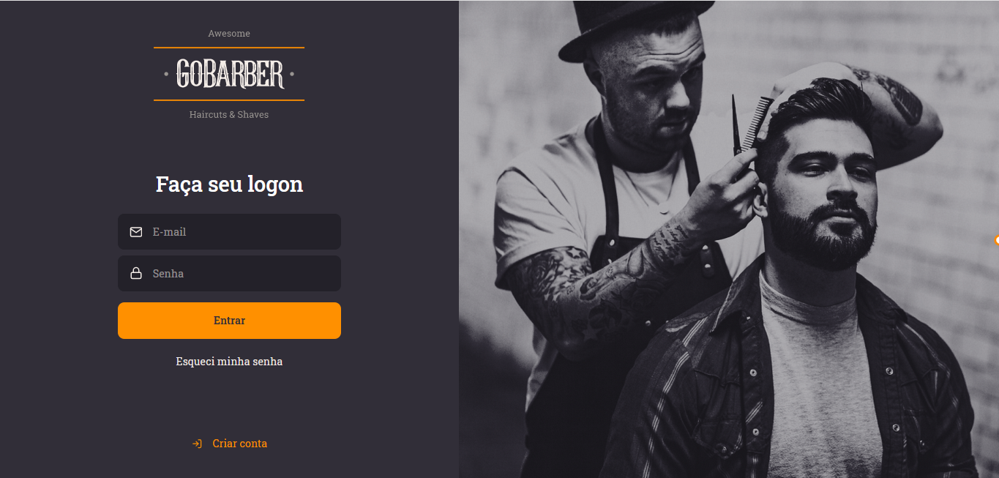
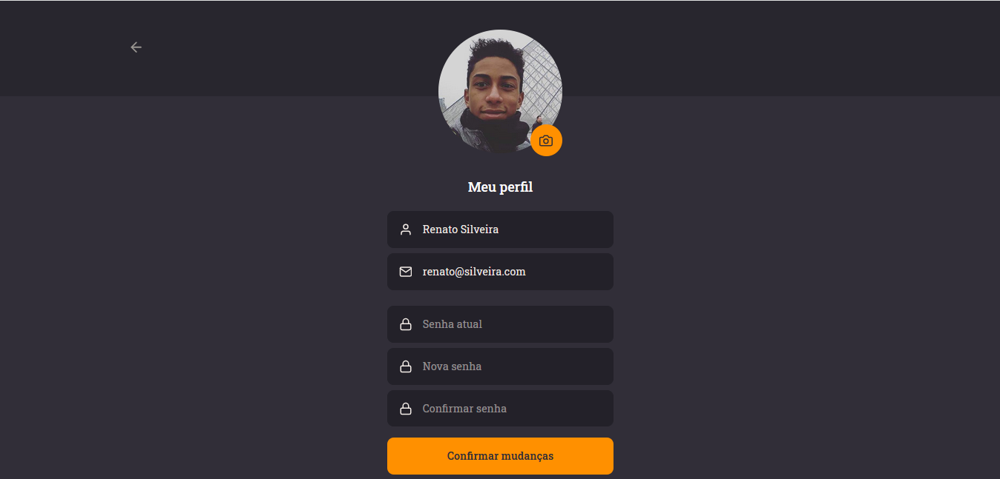
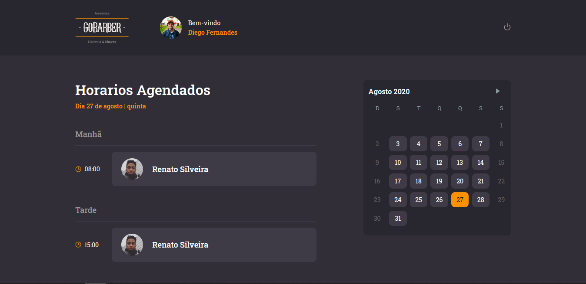

# GoBarber

GoBarber is a frontend application for managing appointments at barbershops and beauty salons. Developed during the GoStack Bootcamp by Rocketseat, this React-based web interface allows service providers to manage their schedules, while users can book appointments through the mobile app.

**Note:** This frontend application works in conjunction with the [GoBarber API](https://github.com/renatosilveira99/go-barber-api), which provides the backend services required for full functionality.

## Features

- **Provider Dashboard**:
  - View and manage appointment schedules.
  - See booked and available time slots.

## Screenshots

<div>
  
  
  
</div>

## Tech Stack

- **Frontend**: React
- **State Management**: Context API
- **Routing**: React Router
- **Form Handling**: Unform
- **Styling**: Styled-components

## Installation

1. **Clone the repository**

   ```bash
   git clone https://github.com/yourusername/gobarber.git
   ```

2. **Navigate to the project directory**

   ```bash
   cd gobarber
   ```

3. **Install dependencies**

   ```bash
   npm install
   ```

4. **Start the application**

   ```bash
   npm start
   ```

## Running Tests

To run the tests for this application, use:

```bash
npm test
```
